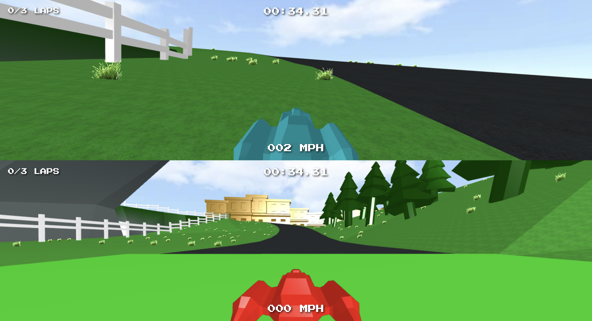

# Hovercrafts

Hovercrafts a is a browser-based 3D racing game. It started as the final project for a JMU computer graphics course. It features custom rendering and physics engines. It also fully uses custom models designed in Blender.

## Running

The simplest way to locally run this project is by cloning it and run `npm run dev` from the project root.

It can be played with either gamepad controllers or wasd/ijkl keyboard controls

## Known issues

- TODO: There are a few places on the map where the hovercraft can fall off the map. There should be a check that can reset the game if this happens
